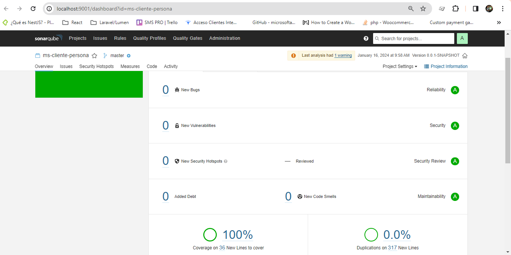

# Documentación del API MS Cliente

## Características
Api rest de cun CRUD de clientes. Se hace uso de Spring Data JPA con manejador de base de datos MySql.

## Configuración
Antes de ejecutar la aplicación, es necesario configurar las siguientes propiedades en el archivo `application.properties`:

### Configuracion de base de datos
En el proyecto existe un script que permite la creación del esquema de base de datos llama ([BaseDatos.sql](./BaseDatos.sql)).
Además se debe de configurar en el archivo application.properties las propiedades correspondientes para MySQL:
```properties
spring.datasource.url=jdbc:mysql://${MYSQL_SERVER_IP:localhost}:${MYSQL_SERVER_PORT:3306}/api_cliente
spring.datasource.username=${MYSQL_USER:root}
spring.datasource.password=${MYSQL_PASSWORD:dbpass}
spring.datasource.driverClassName=com.mysql.cj.jdbc.Driver
```
Se puede indicar mediante variables de entorno los datos necesarios para conectar a la base de datos, de no indicarse se toman 
los datos por defecto

- **MYSQL_SERVER_IP:** Ip o nombre del servidor de la base de datos
- **MYSQL_SERVER_PORT:** Puerto de la base de datos
- **MYSQL_USER:** Usuario de de la base de datos
- **MYSQL_PASSWORD:** Password del usuario con acceso a la base de datos

El proyecto incluye la configuración necesaria para que las tablas se creen automaticamente al ejecutar el proyecto.
Por defecto esta configuración se encuentra, comentada pero basta con descomentar las siguientes propiedades para que se creen las tablas:

```properties
spring.jpa.hibernate.ddl-auto=dreate-drop
spring.sql.init.mode=always
spring.jpa.defer-datasource-initialization=true
```
### Configuracion RabbitMQ
Como Message Broker se implemento rabbitMQ, para configurar se deben de indicar las siguientes variables de entornos definidas en el `application.properties`:
```properties
spring.rabbitmq.host=${RABBITMQ_HOST:localhost}
spring.rabbitmq.port=${RABBITMQ_PORT:5672}
spring.rabbitmq.username=${RABBITMQ_USER:guest}
spring.rabbitmq.password=${RABBITMQ_PASSWORD:guest}

rabbitmq.queue.name=devsu.clientes.queue
rabbitmq.queue.exchange=devsu.clientes.exchange
rabbitmq.queue.routing.key=devsu.clientes.routingKey
```
- **RABBITMQ_HOST:** Servidor donde se esta ejecutando rabbitMQ
- **RABBITMQ_PORT:** Pruerto de comunicacion
- **RABBITMQ_USER:** Usuario con acceso al servidor RabbitMQ
- **RABBITMQ_PASSWORD:** Clave de acceso del usuario servidor RabbitMQ
- **rabbitmq.queue.name** -> Indica el nombre de la cola donde se publicaran los mensajes
- **rabbitmq.queue.exchange** -> Indica el nombre del exchange donde se publicaran los mensajes
- **rabbitmq.queue.routing.key** -> Identificador de la ruta

## Documentacion 
Para ingresar a la documentacion del api desarrollada se debe ingresar a [click](http://localhost:8081/swagger-ui/index.html)

## Sonarqube
El codigo fue analizado con sonarqube:8.9-community dokerizado\
