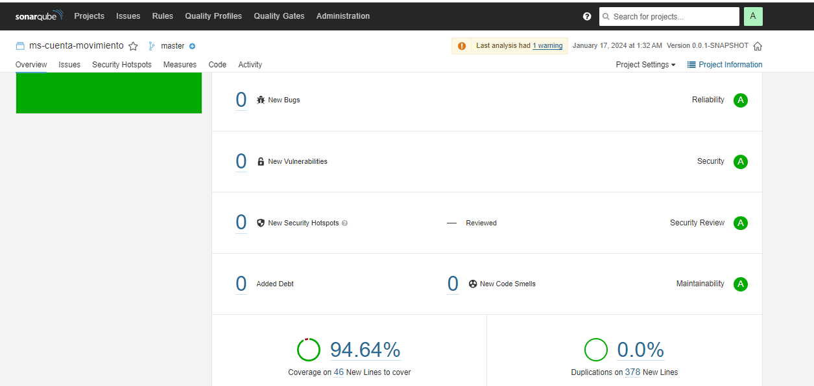

# Documentación del API MS Cuenta Movimientos

## Características
Api rest de cun CRUD de cuentas y movimientos. Se hace uso de Spring Data JPA con manejador de base de datos MySql.

## Configuración
Antes de ejecutar la aplicación, es necesario configurar las siguientes propiedades en el archivo `application.properties`:

## Puerto de ejecucion
```properties
server.port=8082
```

### Configuracion de base de datos
En el proyecto existe un script que permite la creación del esquema de base de datos llama ([BaseDatos.sql](./BaseDatos.sql)).
Además se debe de configurar en el archivo application.properties las propiedades correspondientes para MySQL:
```properties
spring.datasource.url=jdbc:mysql://<Tu host>:<Tu puerto>/<Tu base de datos>
spring.datasource.username=<Tu username>
spring.datasource.password=<Tu password>
spring.datasource.driverClassName=com.mysql.cj.jdbc.Driver
```
El proyecto esta configurado para pruebas locales de la siguiente manera
```properties
spring.datasource.url=jdbc:mysql://localhost:3306/api_cuenta_movimiento
spring.datasource.username=root
spring.datasource.password=dbpass
```
El proyecto incluye la configuración necesaria para que las tablas se creen automaticamente al ejecutar el proyecto.
Por defecto esta configuración se encuentra, comentada pero basta con descomentar las siguientes propiedades para que se creen las tablas:

```properties
spring.jpa.hibernate.ddl-auto=dreate-drop
spring.sql.init.mode=always
spring.jpa.defer-datasource-initialization=true
```

## Documentacion
El api esta documentado con swagger haciendo uso de springdoc-openapi-starter-webmvc-ui. 
Para ingresar a la documentacion del api desarrollada se debe ingresar a [click](http://localhost:8082/swagger-ui/index.html)

La colleccion de Postman la puede obtener [ms-cuenta-movimiento.postman_collection.json](./ms-cuenta-movimiento.postman_collection.json)

## Sonarqube
El codigo fue analizado con sonarqube:8.9-community dokerizado\
